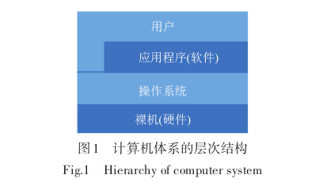

# 1 嵌入式操作系统的概念和特点
## 1.1嵌入式操作系统的概念

操作系统（Operating System，OS）是计算机系统中基础的系统程序，它对整个计算机控制系统的硬件和软件信息进行控制和处理，以合理配置整个计算机控制系统的能力和资源，促进计算机与其他硬件和软件的连接和通信。如图1所示，操作系统处于硬件之上，直接面向硬件，统一管理硬件资源；处于用户和应用程序之下，帮助应用程序访问各种物理资源并提供抽象的接口。

嵌入式系统运行在计算机平台中，用于控制和管理其他设备，其硬件和软件可进行裁剪和配置，软件代码短小而精悍，可以固化，并具有低功耗、高可靠性、高稳定性的特征。嵌入式系统结构通常由四部分组成，包括嵌入式微处理器、外设硬体装置、嵌入式作业系统和应用程序。嵌入式系统在电信系统、电子产品、仪表、航空电子、医疗设备、智能家居等领域都有广泛的应用。

嵌入式操作系统［3］在嵌入式芯片环境中运行，并且对整个芯片系统及其可操作、管理的所有单元设备、部件装置等资源实现统一的协调、调度、指挥和控制［4］。在实现智能测量仪器的过程中，嵌入式操作系统的作用有：为测量仪器的硬件模块提供底层驱动，以传递控制数据信号；协调测量系统应用层各个模块的功能调度，保证整个系统的实时性。嵌入式操作系统通常分为分时操作系统和实时操作系统。

[3]王腾飞.对计算机嵌入式实时操作系统的研究及分析［J］.科技创新与应用，2020（36）：2.WANG T F. Research and analysis of computer embed⁃ded real-time operating system［J］. Technology innova⁃tion and application，2020（36）：2.（in Chinese）
[4]宋然，严国萍.嵌入式实时操作系统（RTOS）研究［J］.计算机测量与控制，2001（z1）：3.SONG R， YAN G P. Research on embedded real-time op⁃erating system（RTOS）［J］. Com- puter measurement and control，2001（z1）：3.（in Chinese）
## 1.2 分时操作系统
在分时操作系统中，多个用户共同使用一台主机，在一定程度上节省了资源。系统服务请求采用时间片轮转的方式处理，多个终端通过通信线路连接，多个用户交替地占用主机服务器上的时间片来处理作业。

分时操作系统的典型代表是Linux操作系统，也是目前较为普及的开源操作系统。Linux操作系统的系统内核性能高、稳定、安全、网络特性好，具有良好的可移植性、可靠的系统安全以及丰富的驱动以支持广泛的周边硬件设备。

分时操作系统能够向用户提供良好的界面和及时的响应，每次应用中得到系统资源的机会比较平等，而且出现重复垃圾任务的机会较小，相对来说也能够缩短CPU的闲置时间。不过分时操作系统还面临着可靠性问题和数据通信的困难，因此需要特别注意用户程序和用户数据的安全与完整性，而且分时操作系统不能处理一些紧急任务，它循环地为每个用户/作业服务一个时间片，对每个用户/作业完全公平，所以实时处理用户任务的能力比较欠缺。
## 1.3 实时操作系统
实时操作系统，是指能够在有限的响应时间内，将所需紧急性等级的服务提供给应用程序的操作系统。“实时”是指运行操作系统的计算机对于输入信息可以做出及时的处理，并在被处理对象指导的时间范围内迅速做出反应。因此，实时操作系统在内核设计、调度策略选择、任务优先级的分配等方面与其他操作系统均有显著差异，典型例子是VxWorks，RT-Thread、鸿蒙系统等。

实时操作系统的显著特点是具有较高的及时性，根据任务的实时需求，执行优先调度，在规定时间内完成对该事件的处理；同时也具有较高的可靠性。
